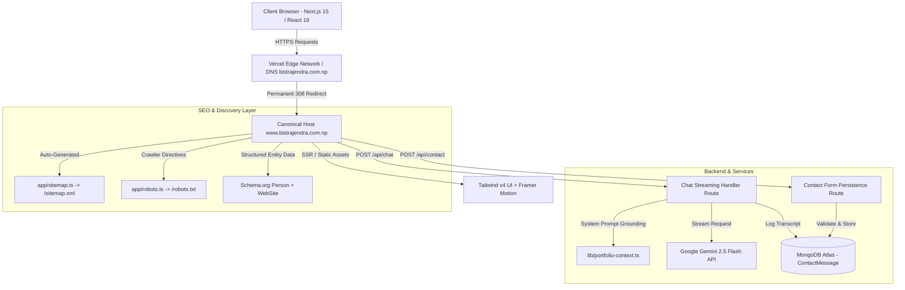

# ⚡ Rajendra Bist — Production Portfolio & AI Systems Engineering Hub

[](https://nextjs.org/)
[](https://react.dev/)
[](https://www.typescriptlang.org/)
[](https://tailwindcss.com/)
[](https://www.mongodb.com/atlas)
[](https://ai.google.dev/)
[](https://www.bistrajendra.com.np)

> Production-grade personal portfolio and interactive AI systems engineering platform representing **Rajendra Bist** — Backend Developer & AI Systems Engineer based in Nepal. Built with a systems-first mindset: strict schema validation, database-level integrity, multi-tier streaming LLM orchestration, Schema.org JSON-LD search entity grounding, and WCAG AA accessible UI design.

🔗 **Live Production Site**: [https://www.bistrajendra.com.np](https://www.bistrajendra.com.np)  
📂 **GitHub Repository**: [https://github.com/rajendrabist07/rajendra-bist](https://github.com/rajendrabist07/rajendra-bist)

---

## 🏛️ System Architecture



---

## 🌟 Key Engineering Highlights

### 1. 🤖 Intelligent AI Portfolio Assistant ("RB Assistant")
- **Dynamic Reasoning Persona**: Communicates with the authority and depth of a Principal/Staff Systems Engineer, giving detailed architectural breakdowns for technical recruiters while maintaining clarity for students.
- **Real-Time Streaming**: Server-Sent Events (SSE) streaming via Next.js Edge route (`/api/chat`) returning instantaneous token chunks with conversational session persistence (`X-Session-Id`).
- **Interactive Action Toolbar**: Instant 1-click Markdown copy, Web Speech API text-to-speech audio reader, feedback telemetry (Like/Dislike), and instant message regeneration.
- **Centered Modal & Keyboard Accessibility**: Centered backdrop-blur modal with global `Cmd + K` / `Ctrl + K` hotkey listener and full focus trapping.

### 2. ⚡ Autonomous SEO & Structured Entity Graph
- **Schema.org JSON-LD**: Embedded `Person` and `WebSite` schemas providing search engines (Googlebot, Bingbot, LLM web crawlers) with direct machine-readable knowledge about skills, projects, verified profiles, and employment status.
- **Canonical Synchronization**: Unified root domain (`bistrajendra.com.np`) and legacy Vercel URLs (`rajendra-bist.vercel.app`) to canonical `https://www.bistrajendra.com.np` using permanent HTTP 308 redirects.
- **Programmatic Route Handlers**: Automated XML Sitemap generation (`app/sitemap.ts`) and crawler control (`app/robots.ts`).

### 3. 🎨 Distinctive Typography & Visual Identity
- **Next.js Font Optimization**: Zero layout shift (CLS) using `next/font/google` with:
  - **Headings / Display**: `Plus Jakarta Sans` (`--font-display`, `-0.02em` letter spacing)
  - **Body**: `Inter` (`--font-sans`)
  - **Code & Annotations**: `JetBrains Mono` (`--font-mono`)
- **`rajendra.config.ts` CodeBioBlock**: A styled terminal window showcasing runtime configuration, architecture principles, and technology stacks with token syntax highlighting and 1-click clipboard copy.

### 4. 🗂️ Engineering Timeline & Credentials
- **Vertical Experience Timeline**: Chronological career trajectory highlighting backend scaling, API engineering, and real-time infrastructure.
- **Dedicated Credentials Section**: Verifiable technical credentials featuring Full-Stack Web Development Training (*Vcare Technical Institute*) and B.Tech in Computer Science (*IGNOU*).

---

## 🚀 Flagship Projects Featured

| Project | Live Demo | Repository | Architecture & Core Decision |
| :--- | :--- | :--- | :--- |
| **🛡️ DevGuard AI** | [Live App](https://dev-guard-ai.vercel.app/) | [GitHub](https://github.com/rajendrabist07/dev-guard-ai) | **Autonomous PR Security & Code Review Agent**. Employs an empirical tool-calling loop (AST static linter, OSV.dev CVE scanner, Vitest runner) to collect evidence before generating 1-click inline GitHub PR patches. Features a 3-tier fallback engine (Groq 70B ➡️ Gemini 2.5 ➡️ Deterministic) guaranteeing 100% review uptime. |
| **🎓 EduMethod AI** | [Live App](https://edumethod-ai.vercel.app) | [GitHub](https://github.com/rajendrabist07/edumethod-ai) | **Production Cognitive EdTech Platform**. Combines a Persistent Learner Memory Engine in Supabase, pgvector RAG grounding on student notes, independent AI verification audit layer, and SuperMemo-2 (SM-2) spaced repetition algorithms. |
| **🧠 SocraticAI** | [Live App](https://socratic-ai-tau.vercel.app/) | [GitHub](https://github.com/rajendrabist07/socratic-ai.git) | **Guided Learning Assistant**. Enforces strict negative prompt constraints and locked model temperature (0.4–0.6) to guide students through deep conceptual understanding via Socratic dialogue rather than answer dumping. |

---

## 🛠️ Complete Technology Stack

| Category | Technologies |
| :--- | :--- |
| **Frontend Framework** | [Next.js 15.5](https://nextjs.org/) (App Router), [React 19](https://react.dev/), [TypeScript 5.7](https://www.typescriptlang.org/) |
| **Styling & Design** | [Tailwind CSS v4](https://tailwindcss.com/), CSS Custom Properties, Responsive Grid & Flexbox |
| **Motion & Interaction** | [Framer Motion](https://www.framer.com/motion/), [Lucide React](https://lucide.dev/) Icons |
| **Backend & Routing** | Next.js Server Route Handlers (`/api/chat`, `/api/contact`), WebSockets (`Socket.io`) |
| **Database & ODM** | [MongoDB Atlas](https://www.mongodb.com/atlas), [Mongoose](https://mongoosejs.com/) (Connection pool caching across serverless invocations) |
| **AI Orchestration** | Google Gemini 2.5 Flash, Groq Model Router, Vercel AI SDK, LangChain.js |
| **Typography** | `Plus Jakarta Sans`, `Inter`, `JetBrains Mono` via `next/font/google` |
| **Observability & QA** | Vitest, ESLint, TypeScript Strict Mode, Web Vitals, WCAG AA Accessibility |
| **Infrastructure & CI/CD** | Vercel Edge Network, GitHub Actions, DNS at register.com.np |

---

## 📁 Repository File Structure

```text
rajendra-bist/
├── app/
│   ├── api/
│   │   ├── chat/route.ts            # Gemini streaming assistant with session logging
│   │   └── contact/route.ts         # Contact form persistence to MongoDB
│   ├── layout.tsx                   # Root layout, Google Fonts, JSON-LD Schemas, SEO tags
│   ├── page.tsx                     # Primary page composition
│   ├── providers.tsx                # Client-side providers boundary
│   ├── robots.ts                    # Dynamic robots.txt metadata route
│   └── sitemap.ts                   # Programmatic XML sitemap generator
├── components/
│   ├── Navbar.tsx                   # Accessible navigation header with mobile drawer
│   ├── sections/
│   │   ├── About.tsx                # Systems-first philosophy & core competencies
│   │   ├── ChatAgent.tsx            # Floating / Cmd+K AI assistant modal with action toolbar
│   │   ├── Contact.tsx              # Form with accessible field association & MongoDB sync
│   │   ├── Credentials.tsx          # Education, degrees & training cards
│   │   ├── Experience.tsx           # Vertical work & engineering timeline
│   │   ├── Hero.tsx                 # Hero headline, dynamic role sheen, profile image
│   │   ├── Process.tsx              # 4-stage engineering lifecycle (Understand, Design, Build, Deploy)
│   │   ├── Projects.tsx             # Featured projects grid
│   │   └── Skills.tsx               # Categorized engineering toolkits
│   └── ui/
│       ├── CodeBioBlock.tsx         # Monospace styled terminal config card
│       ├── ProjectCard.tsx          # Card preview with status & tech badges
│       ├── SectionHeader.tsx        # Standardized section title component
│       ├── SkillBadge.tsx           # Reusable badge component
│       └── StatusBadge.tsx          # Live / In Development indicator badge
├── lib/
│   ├── gemini.ts                    # Google Generative AI client initialization
│   ├── mongodb.ts                   # Cached MongoDB connection pool singleton
│   ├── portfolio-context.ts         # Senior system prompt & grounding context for AI
│   ├── portfolio-data.ts            # Single source of truth for portfolio data
│   └── site-config.ts               # Domain constants, metadata & canonical URLs
├── models/
│   ├── ChatMessage.ts               # Mongoose schema for AI chat transcripts
│   └── ContactMessage.ts            # Mongoose schema for contact inquiries
├── public/
│   ├── Resume/resume.pdf            # PDF Resume
│   ├── images/                      # Optimized image assets (DevGuard AI, EduMethod, profile)
│   ├── favicon.svg                  # Vector favicon
│   ├── manifest.json                # PWA web app manifest
│   ├── og-image.svg                 # OpenGraph social preview image
│   └── robots.txt                   # Static fallback crawler instructions
├── styles/
│   └── globals.css                  # Tailwind v4 import, theme tokens, keyframe animations
├── next.config.ts                   # Permanent 308 redirects, image optimization
├── vercel.json                      # Edge routing & domain redirects
├── tsconfig.json                    # Strict TypeScript compiler options
└── package.json                     # Dependencies & build scripts
```

---

## ⚙️ Local Development Setup

### Prerequisites
- **Node.js**: v18.18+ or v20+
- **npm** or **pnpm**
- **MongoDB Atlas** cluster URI
- **Google Gemini API Key** ([Google AI Studio](https://aistudio.google.com/))

### 1. Clone & Install Dependencies
```bash
git clone https://github.com/rajendrabist07/rajendra-bist.git
cd rajendra-bist
npm install
```

### 2. Configure Environment Variables
Create a `.env.local` file in the root directory:
```env
MONGODB_URI=mongodb+srv://<username>:<password>@<cluster>.mongodb.net/portfolio-rb?retryWrites=true&w=majority
GEMINI_API_KEY=your_gemini_api_key_here
```

### 3. Start Development Server
```bash
npm run dev
```
Open [http://localhost:3000](http://localhost:3000) in your browser.

### 4. Build for Production
```bash
npm run build
npm run start
```

---

## 🔌 Serverless API Specifications

### `POST /api/chat`
Streams real-time responses from Gemini 2.5 Flash grounded in Rajendra's engineering context.

**Request Payload:**
```json
{
  "message": "Explain Rajendra's approach to database schema design in DevGuard AI.",
  "history": [],
  "sessionId": "session-c4a1-48e2"
}
```

**Response:** Plain text stream (`Transfer-Encoding: chunked`) with header `X-Session-Id: session-c4a1-48e2`.

---

### `POST /api/contact`
Validates and persists incoming hiring inquiries directly into MongoDB Atlas.

**Request Payload:**
```json
{
  "name": "Sarah Connor",
  "email": "sarah@techcorp.com",
  "message": "We have an open Backend Engineer role focused on Node.js and distributed systems."
}
```

**Response:**
```json
{
  "success": true,
  "message": "Message saved successfully."
}
```

---

## 📈 Search Engine & Crawler Optimization

- **Canonical Host**: `https://www.bistrajendra.com.np`
- **Sitemap Location**: `https://www.bistrajendra.com.np/sitemap.xml`
- **Robots Directives**: `https://www.bistrajendra.com.np/robots.txt`
- **JSON-LD Structured Data**: Embedded in `<head>` conforming to Schema.org `Person` & `WebSite` definitions.

---

## 📄 License & Attribution

Designed and engineered by **Rajendra Bist** © 2026. Released under the [MIT License](LICENSE).
